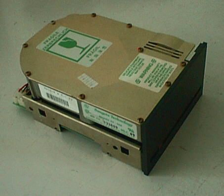
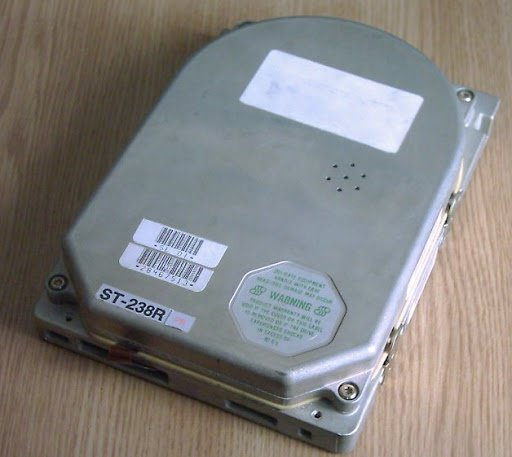
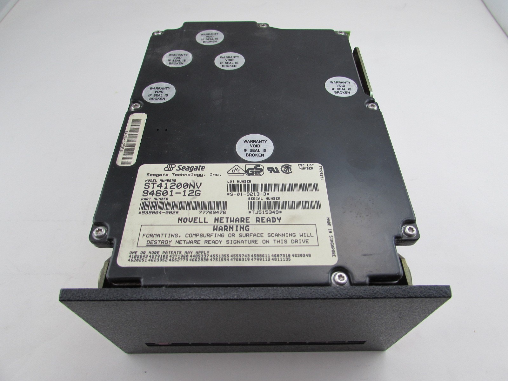
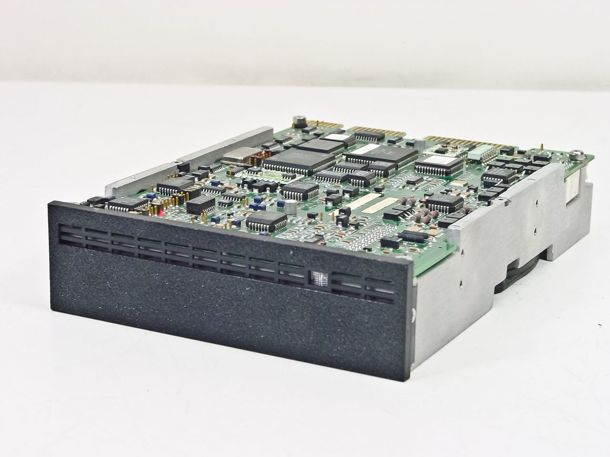
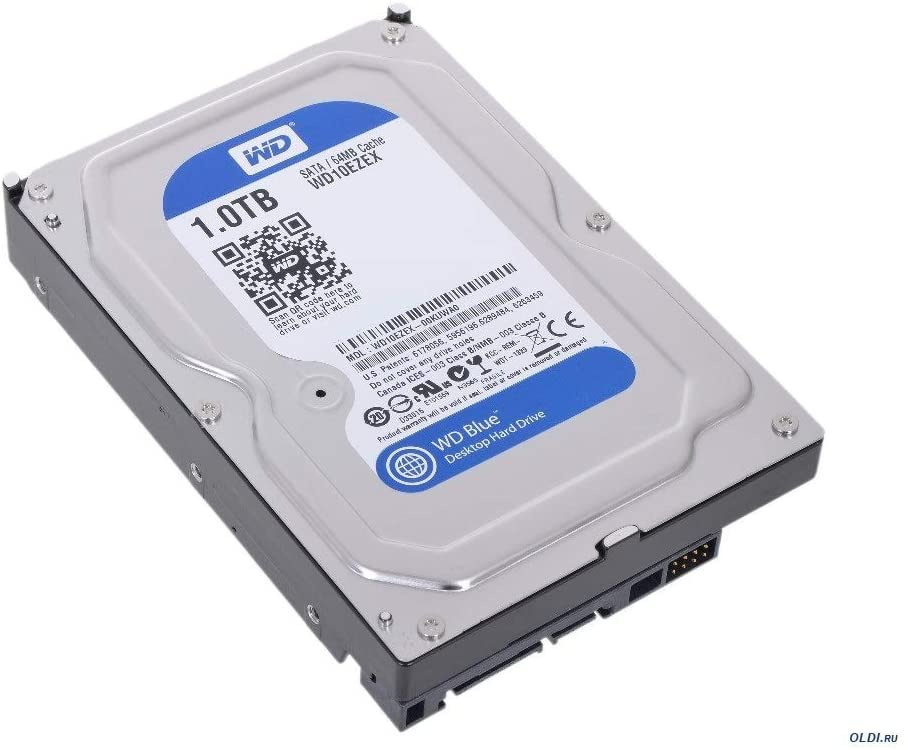
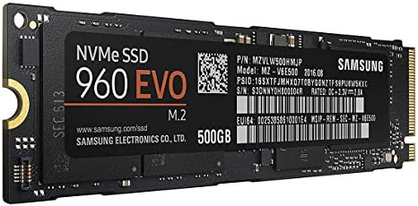
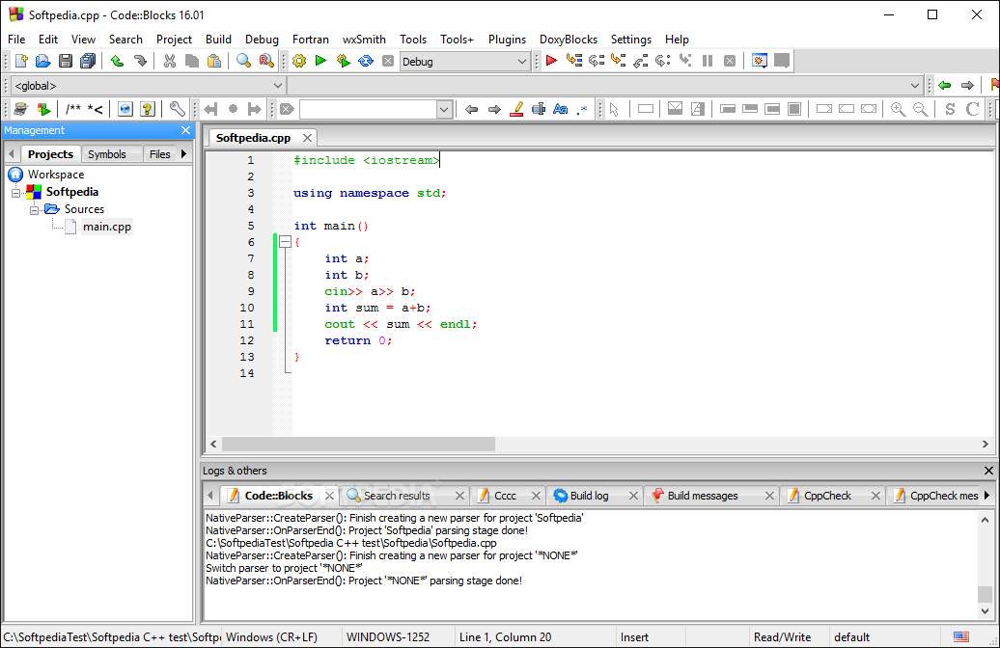

# N/A: Why is Code::Blocks Called IDE?

This one doesn't have any code associated with it.  I just had fun
misinterpreting IDE.  I've reproduced the original post below the cut.

Original: [Why is CodeBlocks called IDE?](https://www.quora.com/Why-is-CodeBlocks-called-IDE/answer/Joe-Zbiciak)

---

Originally it was called Code::Blocks [MFM.](https://en.wikipedia.org/wiki/Modified_frequency_modulation) It was big and clunky.  

Then as technology improved, Code::Blocks
[RLL](https://en.wikipedia.org/wiki/Run-length_limited) was introduced.
While it looked a bit trimmed down, it had much greater capacity. And despite
Wikipedia saying MFM is a form of RLL, it’s important to note that RLL in this
context [meant a 50% increase in bits-per-transition!](https://en.wikipedia.org/wiki/ST506/ST412#History)

And mostly on Macs and Amigas, you could find Code::Blocks
[SCSI.](https://en.wikipedia.org/wiki/SCSI) It was similar in many ways, but
provided a higher level interface. You also sometimes found server editions:

There was also a briefly lived jaunt over to Code::Blocks
[ESDI.](https://en.wikipedia.org/wiki/Enhanced_Small_Disk_Interface)

And that’s when we come to Code::Blocks
[IDE.](https://en.wikipedia.org/wiki/Parallel_ATA#IDE_and_ATA-1)
That was upgraded to EIDE shortly thereafter, and was popular for several
years—basically, most of the 1990s.

These days, you have a choice between Code::Blocks
[SATA:](https://en.wikipedia.org/wiki/Serial_ATA)

And Code::Blocks [NVMe:](https://en.wikipedia.org/wiki/NVM_Express)

---

_Wait a minute… what’s that?_

_Are you saying I got the wrong IDE? … Really?! … Uh huh. … Ok … And that
Code::Blocks isn’t a block storage device. …. Mmm hmm … Ok … Not that kind of
blocks. … Uh huh … Ok … Got it._

---

Sorry about that folks.  

[Code::Blocks](https://en.wikipedia.org/wiki/Code::Blocks) is an
_[integrated development environment,](https://en.wikipedia.org/wiki/Integrated_development_environment)_
and that’s what IDE stands for.

It’s integrated, in the sense that it has a front-end that includes an editor,
GUI designer, debugger,\* and custom build system (and Make support) that will
launch the compiler for you, all from within that front end.

---

\*_Addendum:_ Actually it just invokes an external debugger as Jerry Coffin
[mentions](https://www.quora.com/Why-is-CodeBlocks-called-IDE/answer/Joe-Zbiciak?comment_id=163019652&comment_type=2)
in the comments on the original answer.

____

Copyright © 2023, Joe Zbiciak <joe.zbiciak@leftturnonly.info>  
`SPDX-License-Identifier:  CC-BY-SA-4.0`
