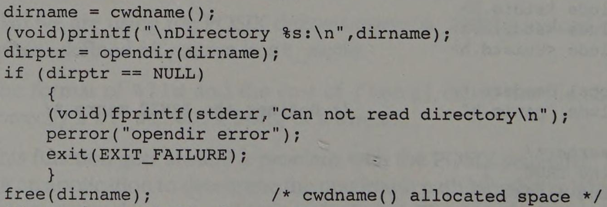

# C: Find Factorial With an If-Else Statement

This one just begged for the full bureaucratic treatment.  In particular, I
decided to adopt a misguided affectation from a
[book I read](https://archive.org/details/posixprogrammers0000lewi) that
suggested casting _all_ ignored return values from functions to `(void)`.
This achieves _exactly nothing of value_ in any real world circumstance.

Consider this real example from the book:



In case the image doesn't appear:

```
dirname = cwdname();
(void)printf("\nDirectory %s:\n",dirname);
dirptr = opendir(dirname);
if (dirptr == NULL)
    {
    (void)fprintf(stderr,"Can not read directory\n");
    perror("opendir error");
    exit(EXIT_FAILURE);
    }
free(dirname);           /* cwdname() allocated space */
```

Yes, `printf` and `fprintf` return values that are ignored more often than not.
And yes, `(void)` tells folks you're ignoring the values that most people don't
even realize are being returned.

But did it prevent any bugs?  Could it have prevented any bugs?

And what if I put a `(void)` cast in front of `perror`, `exit` or `free`?
Would it have caused a compile error?  _No!_  So, why not just put `(void)`
on _every_ function call you don't assign to a variable?

Some C compilers (most or all of which are newer than this book) offer the
ability to tag a return value on some functions as "no-discard." That is, if
the return value isn't looked at, that should be flagged with a warning or
error.

For example, if you ignore the return value from `malloc()`, you've likely
b0rked something.  More subtly, if you've ignored the return value from 
`fgets()` you're likely to b0rk something.

These casts in the book achieve nothing of value, other than adding noise to
a program.  Don't get me wrong: I actually appreciate strictness from the
programming environment when it makes sense.  I apply `const` liberally and
lean hard on the type system to keep me honest.  I use escape valves from the
type system when it makes sense.

This is just gratuitous.

And so it ended up in this "Filed in triplicate as per form 27b/6" homework
answer.

Original: [How do I write a C program for finding the factorial of a number with if else statement?](https://www.quora.com/How-do-I-write-a-C-program-for-finding-the-factorial-of-a-number-with-if-else-statement/answer/Joe-Zbiciak)

____

Copyright © 2023, Joe Zbiciak <joe.zbiciak@leftturnonly.info>  
`SPDX-License-Identifier:  CC-BY-SA-4.0`

