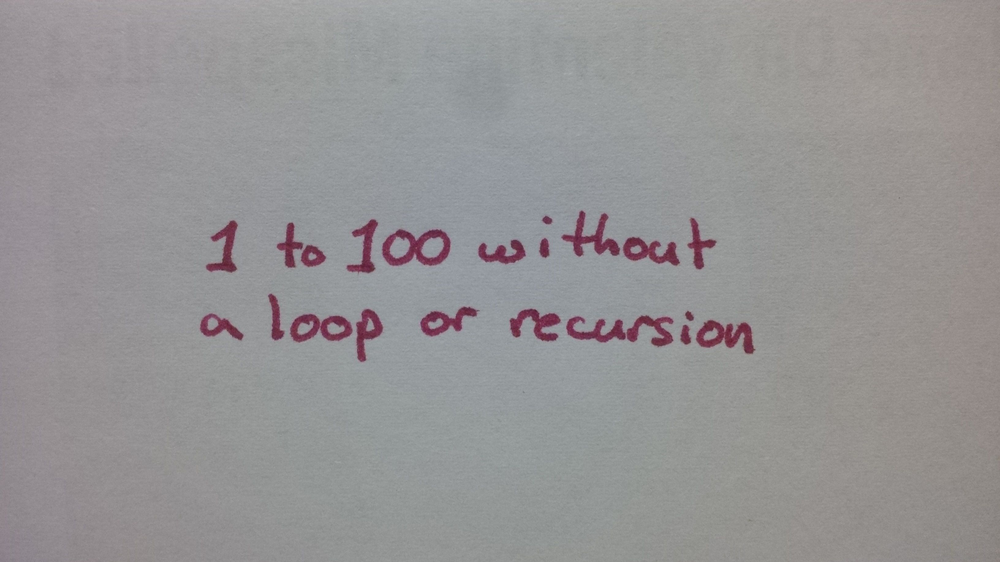

# Bash: Print 1 to 100 Without a Loop or Recursion

This, my friends, seems to be where it allllllll started.  I crossed the line
from mere snarkiness to actual programming homework trolling.

There's not much code for this one.  So, instead, I will reproduce my
[riginal Quora answer](https://www.quora.com/How-can-I-print-1-to-100-without-a-loop-or-recursion/answer/Joe-Zbiciak) here.

## How do I print 1 to 100 without a loop or recursion?

This is how I print _1 to 100 without a loop or recursion_ in UNIX / Linux:

```
$ echo "1 to 100 without a loop or recursion" | lpr
```

This is how I print _1 to 100 without a loop or recursion_ with a pen:



If I published my own newspaper, I might print _1 to 100 without a loop or recursion_ like this:


But this really is dancing around the issue, isn’t it? You didn’t ask how **I**
would print _1 to 100 without a loop or recursion._ You asked how **you** would
print _1 to 100 without a loop or recursion._

I’m sorry, I just don’t know you well enough to answer that. Good luck on your
journey of self discovery!

____

Copyright © 2023, Joe Zbiciak <joe.zbiciak@leftturnonly.info>  
`SPDX-License-Identifier:  CC-BY-SA-4.0`
