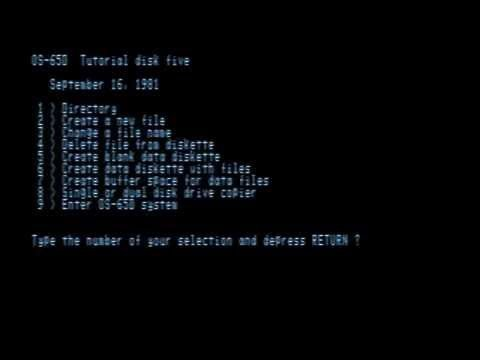

# Quick Answers to Homework Questions

These are all short answers to various homework questions.


## C: Use a While Loop to Identify Odd Numbers

```
#include <stdbool.h>

bool is_odd(unsigned O) {
  while (true) {
    return ~-(O ^ -~O);
  }
}
```

Enjoy the surprised pseudo-emoji.

Original: [Can you use the while loop to identify whether a given number is odd or even without using the modulo or division operation? That is, keep subtracting 2 from the given number until you either reach 1 or 0.](https://www.quora.com/Can-you-use-the-while-loop-to-identify-whether-a-given-number-is-odd-or-even-without-using-the-modulo-or-division-operation-That-is-keep-subtracting-2-from-the-given-number-until-you-either-reach-1-or-0/answer/Joe-Zbiciak)


## C: Find a Prime Below 20 in a single If-Statement

```
if ((x < x - 20ull) << x % 20ull & 02424254)
{
  // is prime
}
```

Original: [How do I find a prime number below 20 in a single if statement in C++?](https://www.quora.com/How-do-I-find-a-prime-number-below-20-in-a-single-if-statement-in-C/answer/Joe-Zbiciak)

## C++: Use a Do-While to Display Z to A

Gotta account for character sets such as EBCDIC, right?

```
#include <iostream>

int main() {
  do;
  while (!
    std::operator<<(std::cout,
    "ZYXWVUTSRQPONMLKJIHGFEDCBA\n")
  );
}
```

Original: [How do I write a do-while loop to display letters from Z to A using the C++ program?](https://www.quora.com/How-do-I-write-a-do-while-loop-to-display-letters-from-Z-to-A-using-the-C-program/answer/Joe-Zbiciak)

## ASM: Multiplying Two Numbers

I pulled the Dealer's Choice card and picked an assembly language OP isn't
likely to know.  The original task was to multiply two numbers and write the
result to a specific address.

```
    MVK.S2   0x2236, B0
||  MVK.S1   0x3421, A0
    MVK.S2   0x5741, B0
||  MPYU.M1X A0, B0, A1
||  MVK.S1   0x89,   B1
    MPYU.M2X A0, B0, B0
||  SHL.S2   B1, 12, B1
    SHRU.S1  A1, 16, A0
||  STH.D2T1 A1, *B1++
    ADD.L1X  B0, A0, A0
    SHRU.S1  A0, 16, A0
||  STH.D2T1 A0, *B1
    STH.D2T1 A0, *++B1
```

Original: [How do you write an ALP (assembly language) to multiply the word 3421H by the double word 57412236H and store the result in locations starting in 89000H?](https://www.quora.com/How-do-you-write-an-ALP-assembly-language-to-multiply-the-word-3421H-by-the-double-word-57412236H-and-store-the-result-in-locations-starting-in-89000H/answer/Joe-Zbiciak)

## Perl: Rank Words by Frequency

I don't get to write much Perl these days, so it was fun to stretch those legs
again.  This reads the input, breaks it into words, counts their frequency, and
then prints them in alphabetical order with their frequency and frequency rank.

```
#!/usr/bin/env perl 
print map{ $W=$W{$_}; "$_\t$W\t".(1+ 
(grep $W<$_, values %W))."\n" } sort 
grep !$W{$_}++, map lc, split /\W+/, 
join '',(<>) 
```

Example:

* Input: `a b b c c d d d e e e e`
* Output:

```
a       1       5
b       2       3
c       2       3
d       3       2
e       4       1
```

## C: Input a Number and Display With Spaces Between Digits

What else can I say?

```
#include <stdio.h> 
 
int main(int c, char **v) { 
   (c = getchar()) 
== EOF 
|| putchar(c) 
&& putchar(' ') 
&& main(c, v); 
} 
```

Original: [How do I write a program in C language which takes a number as input and displays its digits with spaces in between (example: Input 1234, output: 1 2 3 4)?](https://www.quora.com/How-do-I-write-a-program-in-C-language-which-takes-a-number-as-input-and-displays-its-digits-with-spaces-in-between-example-Input-1234-output-1-2-3-4/answer/Joe-Zbiciak)


## C++: Finding a Factorial

One way to spot a homework question at 1000 yards is that it fits the pattern
"_do trivial thing_ using _basic language feature_"  And so it is with this
guy:

```
#include <cmath>
auto function_to_compute_factorial_that_i_totally_didnt_ask_the_internet_to_write_for_me_because_i_do_my_own_homework(unsigned long long x) {
  return std::tgamma(++x);
}
```

Original: [What is a program to find the factorial of a number using a function?](https://www.quora.com/What-is-a-program-to-find-the-factorial-of-a-number-using-a-function/answer/Joe-Zbiciak)

## ASM: Compare Two Numbers Using Assembly

I played the dealer's choice card and used TMS9900.

> For example, on the TMS9900, the C instruction (unrelated to the C
> programming language) can compare two values in registers, two values in
> memory, or some combination. To compare the number in the location `HMWK`
> with the number at the location `ASGMT`, do this:

```
    C @HMWK, @ASGMT
```

Original: [How do I compare two numbers by using an assembly language?](https://www.quora.com/How-do-I-compare-two-numbers-by-using-an-assembly-language/answer/Joe-Zbiciak)

## C++: Algorithm That Checks For Repeated Letters in "Algorithm"

This was indeed truly pointless.

```
#include <stdexcept> 
#include <string> 
 
// Check if any letter is repeated in the word "algorithm." 
bool has_repeated_letter(const std::string& s) { 
  if (s != "algorithm") { 
    throw std::invalid_argument(s); 
  } 
  return false; 
} 
```

Original: [What is the algorithm that checks if any letter is repeated in the word “algorithm”?](https://www.quora.com/What-is-the-algorithm-that-checks-if-any-letter-is-repeated-in-the-word-algorithm/answer/Joe-Zbiciak)

## C++: Program That Decreases a Number From 10 to 0

[My answer:](https://www.quora.com/What-is-a-C-program-that-decreases-a-number-from-10-to-0/answer/Joe-Zbiciak)

```
int main() {
  int x = 10;
  // Decrease x to 0.
  x = 0;
}
```

> Your next programming lesson: Write proper specifications of the problem
> you’re trying to solve. This will have two impacts:  
>
> 1. If you ask for help, you are more likely to get correct and useful help
> if you can clearly state what is required, and what you’ve done to get there,
> and where you got stuck relative to the precise requirements.  
> 2. You will be less likely to actually _need_ to ask for help. The process of
> stating what you’re trying to accomplish more precisely, and what pieces you
> understand, and what parts you’re stuck on, will likely point you in the
> direction you need to go to get yourself unstuck.

## C: Print Individual Characters of a String in Reverse Order

This solution uses recursion when it's not really called for.

```
void print_reverse(const char *const s) {
  if (!*s) return;
  print_reverse(s + 1);
  putchar(*s);
}
```

Original: [How do you write a C program to print individual characters of a string in a reverse order?](https://www.quora.com/How-do-you-write-a-C-program-to-print-individual-characters-of-a-string-in-a-reverse-order/answer/Joe-Zbiciak)

## C++: Count Occurrences of an Element in a Linked List Without Recursion

Heh... back to back with the previous quickie, this is a bit funny.  My usual
dodge with linked lists in C++ is to use `std::list<T>`, as it's a
doubly-linked list implementation.

And, for something like this, there's a standard library function,
`std::count`, just begging to be used.  Throw in a dash of templates and `auto`
and this is innoculated against being a helpful homework answer.

```
#include <algorithm>
#include <list>

template <typename T>
auto count_occurrences(const std::list<T>& list, const T& value) {
  return std::count(list.cbegin(), list.cend(), value);
}
```

Original [How do you write a program that counts the number of occurrences of an element in a linked list without using recursion?](https://www.quora.com/How-do-you-write-a-program-that-counts-the-number-of-occurrences-of-an-element-in-a-linked-list-without-using-recursion/answer/Joe-Zbiciak)

## N/A: Populating a Student and Their Phone Number

This is a case of just reading a question and shaking my head.  The question:

[By using pseudocode, how do you write an algorithm to populate a student and their phone number?](https://www.quora.com/By-using-pseudocode-how-do-you-write-an-algorithm-to-populate-a-student-and-their-phone-number/answer/Joe-Zbiciak)

My answer:

> As for _populating the student,_ I assume their parents already took care of
> adding the student to the population. If you’re unsure of how that process
> works, perhaps consult with your parents, or in a pinch, some biology texts.
>  
> As for their phone number? Ma Bell (or its equivalent in your jurisdiction)
> assigns that. That’s likely “populated” already as well.
> 
> I thought this was supposed to be a programming question.

## Definitions: Two Utilities Found in Operating Systems

The [original question](https://www.quora.com/What-are-two-utilities-found-in-an-operating-system/answer/Joe-Zbiciak)
asked "What are two utilities found in an operating system?"

I gave the following concise answer:

> In POSIX compliant operating systems: `[`. [Link](https://pubs.opengroup.org/onlinepubs/9699919799/utilities/test.html#tag_20_128)
> 
> In Apple DOS 3.3: `MUFFIN`. [Link](https://en.wikipedia.org/wiki/Apple_DOS#:~:text=Apple%20Computer%20released%20a%20utility%20called%20%22MUFFIN%22%20to%20migrate%20Apple%20DOS%203.2%20files%20and%20programs%20to%20version%203.3%20disks.%20Apple%20never%20offered%20a%20utility%20to%20copy%20in%20the%20other%20direction.)

## C++:  Display Sum of First 10 Odd Multiples of 3

I display both a string, and an integer... _sorta._

**Version 1:**

```
#include <iostream>

int main() {
  std::cerr << "the sum of the first 10 "
               "odd multiples of 3\n";
}
```

**Version 2:**

```
#include <iostream>

int main() {
  std::cout << sizeof("Do")
            << +!" your own "
            << -!"homework!"
            << std::endl;
}
```

Original: [What is a program in C++ that displays the sum of the first 10 odd multiples of 3?](https://www.quora.com/What-is-a-program-in-C-that-displays-the-sum-of-the-first-10-odd-multiples-of-3/answer/Joe-Zbiciak)

## Math: Whole Numbers Greater Than 0 But Less Than 10

As I [answered on Quora:](https://www.quora.com/What-are-whole-numbers-greater-than-0-but-less-than-10-Please-answer-quickly-thx/answer/Joe-Zbiciak)

> In base 2, there's only one number that fits the criteria: 1.

## C: Display Your Name

I'm a big fan of compile time evaluation, as I [demonstrated here.](https://www.quora.com/What-is-the-code-of-a-program-written-in-C-language-to-perform-an-output-like-Display-your-complete-name/answer/Joe-Zbiciak)

The OP's name is Ma. Heine Unday, and so I wrote:

```
#error Ma. Heine Unday
```

Ta da!

## C or C++: Show My Name 10 Times Using a Loop

This is almost certainly not what they were looking for.

**C**

```
#include <stdio.h>

int main() {
  const char output[] = "my name 10 times\n";
  for (int i = 0; output[i]; ++i)
    putchar(output[i]);
}
```

**C++**

```
#include <iostream>
#include <string_view>

int main() {
  constexpr auto output = std::string_view("my name 10 times\n");
  for (const auto c : output)
    std::cout << c;
}
```

Original: [How do I show my name 10 times by using a loop?](https://www.quora.com/How-do-I-show-my-name-10-times-by-using-a-loop/answer/Joe-Zbiciak)

## C++: Find Permutations of a "Number"

I'm pretty sure OP wanted to permute the _digits_ of a number, since permuting
a single number is pretty boring.  If you're asked to permute a single number,
there's only one permutation, the number itself!

I used an earlier version of
[Digit Adaptor](https://github.com/intvnut/digit_adaptor) for this answer. The
more recent version linked here should also work.  The resulting program was
tiny as a result:

```
#include "digit_adaptor.hh"

#include <algorithm>
#include <iostream>
#include <iterator>

int main() {
  using int_type = unsigned long long;
  auto number = int_type{0};

  std::cout << "Input a number: ";
  std::cin >> number;

  auto da = digit_adaptor<int_type, 10>{number};

  std::sort(std::begin(da), std::end(da));

  do {
    for (const auto d : da) {
      std::cout << d;
    }
    std::cout << '\n';
  } while (std::next_permutation(std::begin(da), std::end(da)));
}
```

Original: [How do I write a program to find the permutations of a number using C++?](https://www.quora.com/How-do-I-write-a-program-to-find-the-permutations-of-a-number-using-C/answer/Joe-Zbiciak)

## C++: Find Four Digit Numbers Where First Digit is Greater Than Sum of Third and Fourth Digits

This one, like the previous one, is also based on
[Digit Adaptor](https://github.com/intvnut/digit_adaptor).  It's such an
efficient tool for these sorts of homework questions!

```
#include <iostream> 
#include "digit_adaptor.hh" 

int main() {
  auto u = 1000u;
  auto da = digit_adaptor<unsigned>{u};

  for (u = 1000; u <= 9999; ++u)
    if (da[0] > da[2] + da[3])
      std::cout << u << '\n';

  return 0;
}
```

Original: [Can someone help me with C++? The task is "four digit numbers which first digit is greater that the sum of the third and fourth digits."](https://www.quora.com/Can-someone-help-me-with-C-The-task-is-four-digit-numbers-which-first-digit-is-greater-that-the-sum-of-the-third-and-fourth-digits/answer/Joe-Zbiciak)

## Flowchart: How to Draw a Flow Chart for `$ALGORITHM`

My answer applies to multiple questions of this form, since it's agnostic to
`$ALGORITHM`.

```
  _________________________
 (__________Start__________)
              |
              V
              __
            _/  \_
          _/      \_
        _/          \_              +-------------------+
       /   Is ASCII   \___________\ | Type it in like   |___
       \_   art OK?  _/   Yes     / | this answer does. |   |
         \_        _/               +-------------------+   |
           \_    _/                           ^             |
             \__/                             |             |
              |                               |             |
              | No                            |             |
              V                               |             |
              __                              |             |
            _/  \_                            |             |
          _/      \_                          |             |
        _/          \_              +-------------------+   |
       /  Posting it  \___________\ | Better stick to   |   |
       \_  on Quora? _/   Yes     / | ASCII anyway to   |   |
         \_        _/               | avoid meme slap.  |   |
           \_    _/                 +-------------------+   |
             \__/                                           |
              |                                             |
              | No                                          |
              V                                             |
+-----------------------------+                             |
| Use pencil and paper or a   |                             |
| vector-based drawing tool.  |                             |
+-----------------------------+                             |
              |                                             |
              V                                             |
  _________________________                                 |
 (___________Stop__________)<-------------------------------+
```

Original: [How can I draw a flow chart for calculating average and sum by a multidimensional array?](https://www.quora.com/How-can-I-draw-a-flow-chart-for-calculating-average-and-sum-by-a-multidimensional-array/answer/Joe-Zbiciak)


## ASM: Print Location of Input Value

A little creative interpretation leads me to:

```
    MOV  DX, message
    MOV  AH, 9
    INT  021h

    MOV  AH, 04Ch
    INT  021h

message:
    DB   "San Jose, CA$"
```

Why San Jose?  As I said in the answer:

> After all, San Jose is where I’m at currently, and so all of my input values
> will come from here.

Original: [What is the assembly language code that prints the location of input value?](https://www.quora.com/What-is-the-assembly-language-code-that-prints-the-location-of-input-value/answer/Joe-Zbiciak)

# Any: Print Two Integers, Larger Before Smaller

I'll just quote
[the original](https://www.quora.com/How-can-I-write-two-integers-and-print-them-in-the-order-of-a-larger-first-and-smaller-second/answer/Joe-Zbiciak)
here, as it's short.

> If you’re writing a computer program to do this, there’s an easy way to
> accomplish your goal.  
>
> Read your two integers into two variables. Let’s call them `a` and `b`.  
>
> Now print out `a`, followed by `b`, followed by `a`.  
>
> You’re guaranteed in that sequence, if one of the two variables is larger
> than the other, that you’ve printed the larger one before the smaller one
> within that sequence.  

# C: Print The Bigger Number

In the spirit of the previous answer, I offer this
[concise answer to a related question](https://www.quora.com/Write-a-c-program-to-print-the-bigger-number-between-two-numbers-without-using-conditional-operators/answer/Joe-Zbiciak):

> **Write a c program to print the bigger number between two numbers without using conditional operators?**  
>
> I’ll do you one better: I’ll print out both the larger _and_ the smaller of
> the two numbers. Assume the two numbers are in `a` and `b`.
> 
> `printf(“%d %d\n”, a, b);`  
> 
> That will print out both the larger of `a` and `b`, _and_ the smaller of `a`
> and `b`!

## Architecture:  Five Examples of RISC Microprocessors

The OP asked a simple question: "What are 5 examples of a microprocessor of
RISC?" I gave [a simple answer:](https://www.quora.com/What-are-5-examples-of-a-microprocessor-of-RISC/answer/Joe-Zbiciak)

1. [RISC-I](https://en.wikipedia.org/wiki/Berkeley_RISC#RISC_I)
2. [RISC-II](https://en.wikipedia.org/wiki/Berkeley_RISC#RISC_II)
3. RISC-III ([SOAR](https://www2.eecs.berkeley.edu/Pubs/TechRpts/1985/5940.html))
4. RISC-IV ([SPUR](https://news.ycombinator.com/item?id=19266152))
5. [RISC-V](https://riscv.org/risc-v-genealogy/)

## C++: Print a Prime Number Before the Entered Number

The original question asked for the program to be in "the simplest form." I say
it's simplest to outsource the work to tools that know how to do this already.

```
#include <cstdlib>
#include <iostream>
#include <string>

int main() {
  std::string bound;
  std::cout << "Input the upper, non-inclusive bound: ";
  std::cin >> bound;

  std::string command =
      std::string{"/usr/games/primes 1 "} + bound + "| tail -1";
  std::system(command.c_str());
}
```

Of course, Alex Eustis came up with an even simpler interpretation:

```
int main() {
  std::string num;
  std::cout "Enter a number: 31 ";
  std::cin >> num;
}
```

That will indeed print a prime number before whatever the user enters!

Original: [How can we write a simple program in C++ to print a prime number just before the entered number? The program should be in the simplest form.](https://www.quora.com/How-can-we-write-a-simple-program-in-C-to-print-a-prime-number-just-before-the-entered-number-The-program-should-be-in-the-simplest-form/answer/Joe-Zbiciak?no_redirect=1)

## C: Find the Sum of the Hailstone Sequence

The hailstone sequence comes from the
[Collatz conjecture.](https://en.wikipedia.org/wiki/Collatz_conjecture).
For our purposes, it doesn't matter whether all starting points end up
reaching a cycle.  What matters is that the sequence doesn't terminate, and
doesn't change between the categories negative, zero, or positive.

Therefore, we can determine the sum of all terms from a given starting point
quite trivially.

```
#include <math.h>

float sum_hailstone(int x) {
  return x == 0 ? 0
       : x <  0 ? -INFINITY
       :           INFINITY;
}
```

Original: [What is the C program to find the sum of the Hailstone sequence?](https://www.quora.com/What-is-the-C-program-to-find-the-sum-of-the-Hailstone-sequence/answer/Joe-Zbiciak)

## C: Program Inputs 10 Digit Number or it's Invalid

The OP wanted a program in C that would read a 10 digit number.  If the input 
exceeds or falls short of 10 digits, then it should be invalid.  

Clearly _a program in C_ is the antecedant of _it,_ right?

```
#include <stdio.h>

int main() {
  char num[11];

  if (scanf("%[0-9]c%[0-9]c%[0-9]c%[0-9]c%[0-9]c"
            "%[0-9]c%[0-9]c%[0-9]c%[0-9]c%[0-9]c%[0-9]c",
            &num[0], &num[1], &num[2], &num[3], &num[4],
            &num[5], &num[6], &num[7], &num[8], &num[9],
            &num[10]) != 10) {
    char *ptr = NULL;
    ++*ptr;  // Undefined behavior.
  }

  num[10] = '\0';

  return 0;
}
```

_Et voilà!_ This program behaves correctly when given a 10 digit input.
Otherwise, it has undefined behavior, rendering the program invalid.

Original: [How do I write a program in C to enter a number of 10 digits? If the number exceeds or falls short of 10 digit numbers, then it should be invalid.](https://www.quora.com/How-do-I-write-a-program-in-C-to-enter-a-number-of-10-digits-If-the-number-exceeds-or-falls-short-of-10-digit-numbers-then-it-should-be-invalid/answer/Joe-Zbiciak)

## Mathematics: Finding Minimum Superpermutations

You've gotta love questions that ask for an answer to an open question in
mathematics with a straight face.  Some of these are likely trolls.  For this
one it's hard to be sure.  In any case, I'll just quote the
[original answer](https://www.quora.com/What-function-outputs-the-minimum-length-of-a-character-string-that-read-left-to-right-contains-every-permutation-of-n-characters-e-g-for-n-2-y-n-3-because-the-string-aba-contains-every-permutation-of-a-b/answer/Joe-Zbiciak)
here, as it's short:

> **What function outputs the minimum length of a character string that,
> read left to right, contains every permutation of n characters? (e.g.
> for n = 2, y(n) = 3, because the string 'aba' contains every permutation
> of {a,b}.**  
>
> This is called a
> [superpermutation.](https://en.m.wikipedia.org/wiki/Superpermutation)  
> 
> For 1 ≤ _n_ ≤ 5, we know the
> [lengths of the minimum length superpermutations.](https://oeis.org/A180632)
> However, the easy stuff stops there. Quoting Wikipedia:  
>
> > For the cases of n > 5, a smallest superpermutation has not yet been proved
> > nor a pattern to find them, but lower and upper bounds for them have been
> > found.  
>
> So, you've got yourself an open question, mathematically speaking.
> 
> _Good luck!_

## OS: Name Any Two Operating Systems

Naturally, I went with [Apple SOS](https://en.wikipedia.org/wiki/Apple_SOS) and
[OS-65D](http://www.osiweb.org/manuals/OS-65D_V3.0_usermanual.pdf).

  


Original: [What are the names of any two operating systems?](https://www.quora.com/What-are-the-names-of-any-two-operating-systems/answer/Joe-Zbiciak)

## BASIC:  Print Two Positive Numbers That Sum to 50

The request doesn't require any computation.  And in ECS BASIC, it doesn't
require anything more than two empty lines of code.  They just have to have
the right line _numbers._


Original: [Can you write a piece of code (in any language) that prints 2 positive numbers (from 0-100) whose sum is 50?](https://www.quora.com/Can-you-write-a-piece-of-code-in-any-language-that-prints-2-positive-numbers-from-0-100-whose-sum-is-50/answer/Joe-Zbiciak)

## ASM:  Loading Data From a Specified Offset

Another homework question asking for assembly code without specifying an
architecture.  So once again, I invoke _dealer's choice!_  In this case,
I chose TMS320C64+, using COFF naming conventions.  The request itself was to
transfer 5 bytes of data from offset `0000h` to offset `0021h`.  I interpreted
"offset" as "from the start of data."

```
    .data 
    .global _hmwk_2_7_data 
_hmwk_2_7_data: 
    .byte   020h, 040h, 011h, 01Fh, 0CDh 
    .space  021h 
 
    .text 
    .global _hmwk_2_7_main 
_hmwk_2_7_main: 
    MVKL   .S2    _hmwk_2_7_data, B1 
    MVKH   .S2    _hmwk_2_7_data, B1 
    LDNW   .D2T1  *B1++(4),       A0 
    LDBU   .D2T1  *B1++(021h),    A1 
||  RETNOP .S2    B3,     3 
    STNW   .D2T1  A0,     *-B1(4) 
    STB    .D2T1  A1,     *B1
```

Original: [What is the program that transfers 5 bytes of data (20H, 40H, 11H, 1FH, 0CDH) from memory location with offset of 0000H to memory location with offset 0021H (assembly code)?](https://www.quora.com/What-is-the-program-that-transfers-5-bytes-of-data-20H-40H-11H-1FH-0CDH-from-memory-location-with-offset-of-0000H-to-memory-location-with-offset-0021H-assembly-code/answer/Joe-Zbiciak)

## ASM:  Reading and Writing at the End of Memory

This asked to read two bytes of data from the last and first memory locations
in the 8086 address map, and then write the result in the last even numbered
location in that same address map.

The following code ought to do the trick on a true 8086.

```
    XOR  BX, BX 
    NOT  BX 
    MOV  SS, BX 
    SHR  BX, 0CH 
    MOV  SP, BX 
    POP  AX 
    MOV  CX, 0101H 
    IMUL CX 
    XCHG AH, [SS:BX - 1] 
```

Quite how it performs its magic is another question.  :-)

Original: [How do I read two data (1 byte) from the last and first memory location of MPU 8086, and store their sum in the last even memory location of MPU 8086?](https://www.quora.com/How-do-I-read-two-data-1-byte-from-the-last-and-first-memory-location-of-MPU-8086-and-store-their-sum-in-the-last-even-memory-location-of-MPU-8086/answer/Joe-Zbiciak)

## C:  Display the Square of Numbers 1 to 10

You've gotta love  homework questions that expect you to display a known
result, without asking you to _compute_ that result.  I'll just quote the
[the original post](https://www.quora.com/How-do-I-write-a-C-programme-that-displays-the-square-of-numbers-1-to-10/answer/Joe-Zbiciak) here:

> I’d use a suitable text editor to enter my presumed solution to my homework assignment, perhaps consulting my notes from class if I wasn’t sure what to write. I’d then compile it (and edit it to fix any compile errors), and test it to ensure it met the assignment’s criteria.  
> 
> I’d also iterate through edit/compile/debug until it was correct. Once it was correct, I’d work on cleaning up the formatting a bit so it doesn’t look like I just barfed a bunch of symbols from my keyboard.  
> 
> I would probably even add a comment at the top indicating my name, the course number and section, the date, the assignment number, and possibly my student ID #, so the grader would know it’s my work and not someone elses. (My ID # was 99520… Yes, I still remember it 22 years later.)  
> 
> What I would not do is ask Quorans to do my homework for me.  
> 
> After all, I might end up with this technically correct answer…
```
#include <stdio.h>

int main() {
    puts("I IV IX XVI XXV XXXVI XLIX LXIV LXXXI C");
}
```
> …which may be fine as long as my professor is cool with Roman numerals, but is otherwise not going to do much good for my grade—neither on this assignment, nor on the midterm exam a week or two from now.


## Bash: Ask For a Floating Point Number

This is one of those questions that leaves you wondering "And then what?"
The original question asked [What is the program that will ask you to input a floating point number?](https://www.quora.com/What-is-the-program-that-will-ask-you-to-input-a-floating-point-number/answer/Joe-Zbiciak).
I'll quote my short answer here:

> That’s pretty straightforward. I’ll implement it in bash:  
```
#!/bin/bash
echo "Please input a floating point number:"
Now, this program is quite rude: It asks you to input the number, but it doesn’t bother to wait for your response.
```
> But, then, that wasn’t part of the problem specification was it?


## Any: Print Which Number Appears Most Frequently From 0 to 100

This is one of those questions that makes you ask: 


> **Write an algorithm which takes a list of integers from 0 to 100 as
> arguments and returns the number which appears the most frequently in
> the list?**  
>
> OK, let me get this straight: You want me to write an algorithm that takes a list of integers from 0 to 100, that is (0, 1, 2, 3, … 100), and then return which of those integers appears most often in that list.  
> 
> None of the integers from 0 to 100 appears more frequently than any of the other integers in that list. Each of the 101 distinct values appears exactly once in that list.  
> 
> You should ask your professor for a clarification on your homework assignment.  
> 
> And, you should probably write the answer yourself, as you won’t get any pedagogical value from asking us here on Quora.  
> 
> You might get some hilariously twisted code, though, if I write your homework answer for you.  

Original: [Write an algorithm which takes a list of integers from 0 to 100 as arguments and returns the number which appears the most frequently in the list?](https://www.quora.com/Write-an-algorithm-which-takes-a-list-of-integers-from-0-to-100-as-arguments-and-returns-the-number-which-appears-the-most-frequently-in-the-list/answer/Joe-Zbiciak)

## C++: Calculate Sum of Even Numbers Using While and If

This short answer does actually calculate the requested sum, and it does use
`while` and `if` statements.

```
int sum_evens_from_0_to_2n(const int n) {
    while (true) {
        if (true) {
            return n * (n + 1);
        }
    }
}
```

Of course, [Ira Perlow](https://www.quora.com/profile/Ira-J-Perlow) pointed out
something I missed:

> You realize that the range was not specified. So does that mean all even
> numbers? Does it include negative even numbers?  
> 
> If it includes all positive and negative numbers, the sum is 0.  
> 
> Otherwise it is infinity, which depending upon the language is represented
> different ways! :D  

He's on the right track.  However,
[Jonas Oberhaser](https://www.quora.com/profile/Jonas-Oberhauser) threw a
well deserved bucket of cold water on that reasoning, pointing out that the
sum doesn't converge, because there's no particular reason you should pair
values centered around zero.

> That's what I thought — now suppose you take out the first 2 and add instead  
> 
> your sum-2 = 0+ (-2)+4 + (-4)+6 + (-6)+8 +….. => infinity (by your logic)  
> 
> Would you then say that 0-2 = infinity?  

You can read more of that thread at the link below:

Original: [How can I calculate the sum of even numbers using while loop and if statement using C++?](https://www.quora.com/How-can-I-calculate-the-sum-of-even-numbers-using-while-loop-and-if-statement-using-C/answer/Joe-Zbiciak)


## Many: Sort With an Array

In this case, I offered unsastifying one line answers in 5 languages!

Perl:
```
@my_array = sort { $a <=> $b } @my_array;
```

Python:
```
my_array.sort();
```

C++:
```
std::sort(std::begin(my_array), std::end(my_array));
```

Bash:
```
my_array=($(echo "${my_array[@]}" | tr ' ' '\012' | sort -n))
```

Java:
```
import java.util.Arrays;
//....
Arrays.sort(my_array);
```

If I were to write this answer today, rather than many years ago, I might
focus on "a number" and offer a
[`digit_adaptor`](https://github.com/intvnut/digit_adaptor) based solution
for sorting the digits within an integer.

Original: [How can I write a program to sort a given number using an array?](https://www.quora.com/How-can-I-write-a-program-to-sort-a-given-number-using-an-array/answer/Joe-Zbiciak)

## C: Print Input and Output in Same Line

I'm pretty sure they just wanted to know about `fflush(stdout)`.  But, I instead
interpreted this as "put all of my C source code for input and output on one
line."

```
#include <stdio.h>
#include <stdlib.h>

int main() { for (int c = 0; (c = getchar()) != EOF && putchar(c) != EOF; ) ; } 
```

After all, it's funnier that way!

Original: [How can I print input & output in the same line for C language?](https://www.quora.com/How-can-I-print-input-output-in-the-same-line-for-C-language/answer/Joe-Zbiciak)

## Pascal: Compute and Display Sum of Integers 1 to 100

I don't see many Pascal questions on Quora.  Pascal has the interesting
requirement that you _name_ your program.  I did not let that go unused.

Quoting my answer:

> Easy:  
> 
```
program i_totally_didnt_ask_the_internet_to_do_my_homework_for_me;

begin
  writeln(5050)
end.
```
> 
> OK, OK, you want it to compute the value. Fine. Let’s lean on good ol’ Carl
> Friedrich Gauss, then:  
> 
```
program i_wrote_this_myself_honest_and_didnt_get_it_from_quora;

begin
  writeln(100 * (100 + 1) / 2)  { Gauss' formula }
end.
```

This one ended up with a comment exchange with the OP:

> **Original Poster**  
> 
> aint funny  
>
> > **Joe Zbiciak**  
> > 
> > Neither is failing a class because you didn’t learn the lessons you’re
> > intended to learn by doing your own homework.  
> >
> > They’re called exercises for a reason. They’re intended to make your
> > skills stronger by having you exercise them.  
> >
> > If I lift weights, your muscles don’t get stronger. You have to lift the
> > weights for that to happen.  
> > 
> > > **Jonas Oberhauser**  
> > > 
> > > Or passing the class, then failing subsequent ones because
> > > the lessons you were intended to learn are used there in subtle
> > > ways… Not realizing why everyone else is moving past you so quickly
> > > while you’re having trouble with the most basic things… Very
> > > depressing to watch, because unlike not understanding one particular
> > > idea in class, it’s not something I can fix in 15 minutes.
> > 
> > **Oleksandr Karimov**  
> > 
> > Disagree.  
> >  
> > It is funny.  


Original: [How can I write a Pascal program that computes and displays a cumulative sum of integers from 1 to 100?](https://www.quora.com/How-can-I-write-a-Pascal-program-that-computes-and-displays-a-cumulative-sum-of-integers-from-1-to-100/answer/Joe-Zbiciak)

## Misc: Which is interpreted language? a) C++. b) C. c) MATLAB. d) Fortran.

Of course, I answered:

> C++, C, and FORTRAN are interpreted, and MATLAB is compiled.  
>
> 1. [C++ interpreter](https://github.com/root-project/cling).  
> 2. [C (and C++) interpreter](https://en.wikipedia.org/wiki/Ch_(computer_programming).  
> 3. [MATLAB compiler](https://www.mathworks.com/products/compiler.html).  
> 4. [FORTRAN interpreter](https://dl.acm.org/citation.cfm?id=29669).  
> 
> The opposite is _also_ true.

Original: [Which is interpreted language? a) C++. b) C. c) MATLAB. d) Fortran.](https://www.quora.com/Which-is-interpreted-language-a-C-b-C-c-MATLAB-d-Fortran/answer/Joe-Zbiciak)

## C: Shortest Tic Tac Toe Implementation

Quoting [the original](https://www.quora.com/What-is-the-most-simple-least-lines-of-code-implementation-of-a-tic-tac-toe-game-you-could-write-in-the-C-programming-language/answer/Joe-Zbiciak)

```
#include <stdio.h>
int main() {
    puts("I resign, you win.");
}
```
> 
> Oh, you want a strategy other than “give up”?  
>

## Definitions: Why Do Clocks Run Clockwise?

The [original question](https://www.quora.com/Why-do-clocks-run-clockwise)
had a comment as well:

> You know, as opposed to running counter-clockwise. And who decided that?

[My answer](https://www.quora.com/Why-do-clocks-run-clockwise/answer/Joe-Zbiciak)
stated the obvious:

> If they ran the other direction, _that_ direction would be called clockwise.

🤔

## Definitions: Banks That Don't Deal With Money

The OP asked
[https://www.quora.com/What-kind-of-bank-doesnt-deal-with-money](https://www.quora.com/What-kind-of-bank-doesnt-deal-with-money/answer/Joe-Zbiciak),
to which I replied:

> I can think of a few:  
> 
> * [River bank](https://tinyurl.com/mr2tmk27)  
> * [Memory bank](https://en.wikipedia.org/wiki/Memory_bank)  
> * [A bank in the road](https://en.wikipedia.org/wiki/Banked_turn)  
> * [Food bank](https://www.google.com/search?q=food%20bank)  
> * Blood bank  
> * Sperm bank  
> * Seed bank  
> * Snow bank  
> 
> I’m sure folks could come up with a few more.

## C:  Most Useful C Function

The OP asked
[As a C programmer, what is one of the most useful functions you’ve ever written?](https://www.quora.com/As-a-C-programmer-what-is-one-of-the-most-useful-functions-you-ve-ever-written/answer/Joe-Zbiciak).
My answer was rather straightforward.

> Without a doubt, I’d have to say `main()`.  
> 
> I’ve written many different versions of `main()`, mind you.
> I customize it a little (or a lot) for each new C program I write.  
> 
> But, it’s so useful, every C program I write gets a copy of `main()`.  
>
> `main()`: Don’t go off to C without it.  

## C++: Can You Implement Any Function Recursively?

The OP asked [Can you implement any function recursively in C++?](https://www.quora.com/Can-you-implement-any-function-recursively-in-C/answer/Joe-Zbiciak)
I suppose you could add trivial, meaningly recursion to anything.  But I went
a slightly different direction:

> What would a recursive version of this function look like? How would you
> define its termination condition?
```
bool answer_to_this_question() { 
  return false; 
} 
```

Ta da.

## GW-BASIC:  Write An Algorithm ... Without Using a Loop

The details of the question didn't really matter to my answer.

> Hmmm. GW-BASIC?  
> 
> *cracks fingers*  
> 
> How quaint.  
```
100 CLS 
110 READ A: PRINT CHR$(A);: IF A > 10 GOTO 110 
120 DATA 68, 111, 32, 121, 111, 117, 114, 32, 111, 119, 110 
130 DATA 32, 104, 111, 109, 101, 119, 111, 114, 107, 33, 13, 10 
```

If you guessed that prints `Do your own homework!`, collect your prize.

Original: [How do I write an algorithm (simple for GW-BASIC) that takes five numbers as input from the user using only 1 variable, calculates and displays their sum, average, and the sum of even numbers (without using a loop)?](https://www.quora.com/How-do-I-write-an-algorithm-simple-for-GW-BASIC-that-takes-five-numbers-as-input-from-the-user-using-only-1-variable-calculates-and-displays-their-sum-average-and-the-sum-of-even-numbers-without-using-a-loop/answer/Joe-Zbiciak)

## C++: Average of First 10 Integers

Here, I just reminded the OP that programming involves using what you already
know.  Quoting the original in its entirety:

> You don’t need C++ for that. You need 5th grade algebra.  
> 
> The average of a set of consecutive integers is equal to the largest integer
> plus the smallest integer in the range, divided by 2.  
> 
> Work it out with pencil and paper: Pair the largest integer in the range with
> the smallest, and divide by 2. Now compare that to the result you get when
> you pair the next largest in the range with the next smallest. Wash, rinse,
> repeat.  
> 
> What, you’re surprised programming involves reasoning outside the computer
> and working things out with pencil and paper? Don’t be. Programming isn’t
> just about typing.  
> 
> The rest of your programming challenge is to define exactly what you mean by
> “first 10.”  
> 
> I think once you work that out, you’ll realize you don’t have much of a
> program left to write. It’ll just print out the answer. But, that was your
> goal, right? No loop?  

Original: [How do I take the average of the first 10 integers in C++ without using a loop?](https://www.quora.com/How-do-I-take-the-average-of-the-first-10-integers-in-C-without-using-a-loop/answer/Joe-Zbiciak)

## C++: Why Can't I Compile At Certain Times?

The OP asked
[In C++, why won’t it let you at certain times build and run the program?](https://www.quora.com/In-C-why-won-t-it-let-you-at-certain-times-build-and-run-the-program/answer/Joe-Zbiciak).

I devised a template that would succeed or fail compilation based on what time
it was as one possible (if unlikely) explanation:

```
template <int i>
int heh() {
  if constexpr (__TIME__[7] % 2) {
    return i + heh<i - 1>();
  }
  return i;
}

int main() {
  return heh<-1>();
}
```

And sure enough:

```
$ g++ -std=c++17 -c foo.cc
$ g++ -std=c++17 -c foo.cc
foo.cc: In instantiation of ‘int heh() [with int i = -900]’:
foo.cc:5:26:   recursively required from ‘int heh() [with int i = -2]’
foo.cc:5:26:   required from ‘int heh() [with int i = -1]’
foo.cc:11:18:   required from here
foo.cc:5:26: fatal error: template instantiation depth exceeds maximum of 900 (use -ftemplate-depth= to increase the maximum)
    return i + heh<i - 1>();
                ~~~~~~~~~~^~
$ g++ -std=c++17 -c foo.cc
$ g++ -std=c++17 -c foo.cc
$ g++ -std=c++17 -c foo.cc
foo.cc: In instantiation of ‘int heh() [with int i = -900]’:
foo.cc:5:26:   recursively required from ‘int heh() [with int i = -2]’
foo.cc:5:26:   required from ‘int heh() [with int i = -1]’
foo.cc:11:18:   required from here
foo.cc:5:26: fatal error: template instantiation depth exceeds maximum of 900 (use -ftemplate-depth= to increase the maximum)
    return i + heh<i - 1>();
                ~~~~~~~~~~^~
$ g++ -std=c++17 -c foo.cc
$
```

## Math: The Number Between 234,457.7 and 234,457.8

The OP asked: [What is the number between 234,457.7 and 234,457.8?](https://www.quora.com/What-is-the-number-between-234-457-7-and-234-457-8/answer/Joe-Zbiciak)

Of course, I answered: 

> 234,457.731415926535897932384626433832795028841971693993751058209749445923078164062862089986280348253421170679821480865132823066470938446095505822317253594081284811174502841027019385211055596446229489549303819644288109756659334461284756482337867831652712019091456485669234603486104543266482133936072602491412737245870066063155881748815209209628292540917153643678925903600113305305488204665213841469519415116094330572703657595919530921861173819326117931051185480744623799627495673518857527248912279381830119491298336733624406566430860213949463952247371907021798609437027705392171762931767523846748184676694051320005681271452635608277857713427577896091736371787214684409012249534301465495853710507922796892589235420199561121290219608640344181598136297747713099605187072113499999983729780499510597317328160963185950244594553469083026425223082533446850352619311881710100031378387528865875332083814206171776691473035982534904287554687311595628638823537875937519577818577805321712268066130019278766111959092164201989.  
> 
> That is **the** number between 234,457.7 and 234,457.8. There is _no other._  
>
> Ok, I take that back. Maybe there’s a [few.](https://en.wikipedia.org/wiki/Irrational_number)

## ASM:  Make Speaker Beep

The OP wanted to make the speaker beep from assembly language.  They didn't
say anything about what platform they're on, what instruction set, or anything.
Also, OP mentions a "beep function in C," but I wasn't aware C had such a thing.

I invoked Dealer's Choice of course, and I even provided three very different
implementations.  Here's my full answer:

> You didn’t specify what machine or anything about the environment, so it’s
> dealer’s choice.
> 
> 6502 on a 1MHz Apple ][:
```
oloop:  BIT $C030
        LDY #$FF
iloop:  DEY
        BNE iloop
        BEQ oloop
```
> 
> CP-1610 on an Intellivision:
> 
```
        MVII #$100, R0
        MVO  R0,  $1F0
        SWAP R0
        MVO  R0,  $1F4
        MVII #$38,  R0
        MVO  R0,  $1F8
        MVII #$F,   R0
        MVO  R0,  $1FB
        CLRR R0
        MVO  R0,  $1FC
        MVO  R0,  $1FD
```
> 
> TMS9900 on the TI-99/4A: ([Source.](http://www.unige.ch/medecine/nouspikel/ti99/tms9919.htm#Notes))
>
```
        LI   R0, >8400
        LI   R1, >8E0F
        MOVB R1, *R0
        SWPB R1
        MOVB R1, *R0
        LI   R2, >9200
        MOVB R2, *R0
```

Original: [https://www.quora.com/How-can-I-make-the-speaker-beep-using-inline-assembly-I-tried-a-lot-and-searched-a-lot-but-all-I-find-doesnt-work-I-dont-want-to-use-the-beep-function-in-C-just-inline-assembly](https://www.quora.com/How-can-I-make-the-speaker-beep-using-inline-assembly-I-tried-a-lot-and-searched-a-lot-but-all-I-find-doesnt-work-I-dont-want-to-use-the-beep-function-in-C-just-inline-assembly/answer/Joe-Zbiciak)


____

Copyright © 2023, Joe Zbiciak <joe.zbiciak@leftturnonly.info>  
`SPDX-License-Identifier:  CC-BY-SA-4.0`
