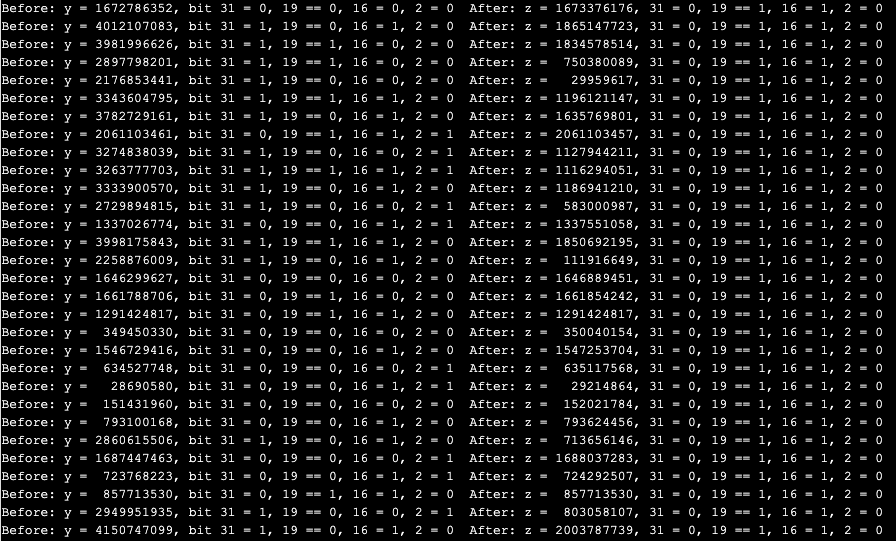

# C: Set Bits 16 and 19 and Clear Bits 2 and 31 With a Single Line of Code.

This homework question is almost certainly testing knowledge of bitwise
operators, and how to form bit masks.  However, you can also accomplish this
task with the modulo operator, addition, and subtraction.

And for extra WTF, all of the constants I used are in decimal, because of
course they are!

For good measure, I made certain to use no bitwise operators or bit-shifts,
because why would I give that away?

Original:  [Assuming a variable named “y” of type “uint32\_t”, what is a single line of code that sets bits 16 and 19 and clears bits 2 and 31?](https://www.quora.com/Assuming-a-variable-named-y-of-type-uint32_t-what-is-a-single-line-of-code-that-sets-bits-16-and-19-and-clears-bits-2-and-31/answer/Joe-Zbiciak)

____

Copyright © 2023, Joe Zbiciak <joe.zbiciak@leftturnonly.info>  
`SPDX-License-Identifier:  CC-BY-SA-4.0`
