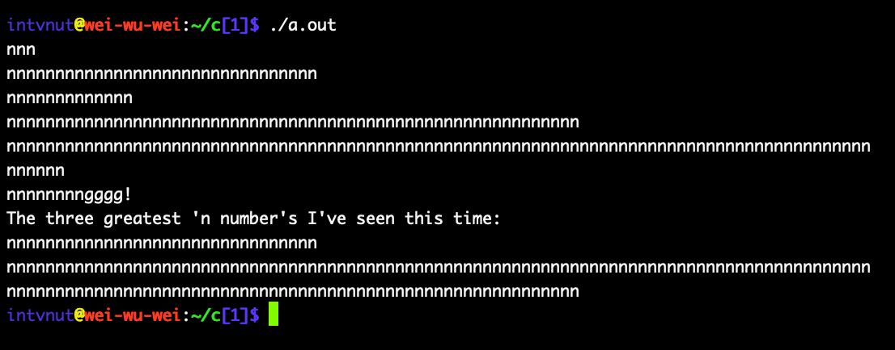
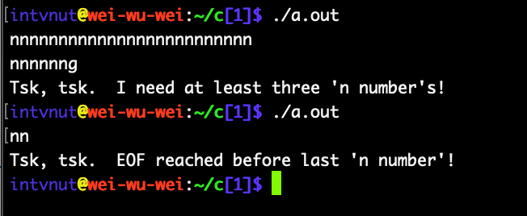

# C++:  Take N Numbers and Display the Greatest Three

The question asked: "How do I write a C++ program that takes n numbers and
displays the greatest three?"  Well, obviously, the first thing you need to
do is define what an _n number_ is!

From my answer:

> First, you should break down the problem specification and break it down
> into more understandable pieces:
> 
> * “takes”: While that might involve a gun and a dark alley, in C++ `std::cin`
>   is a little more convenient.   
> * “n numbers”: For this Quora post, I’ll assume that’s “numbers represented by
>   a series of n’s.”  
> * “displays”: Programmed fireworks displays are awesome. However, for now,
>   let’s settle for _outputting_ the greatest three and letting your OS figure
>   out how to display them.  
> * “greatest”: How do you measure the greatness of an “n number”? Too few ‘n’s
>   and it’s not that great. Too many ‘n’s, and it’s also not that great. Let’s
>   approximate the greatness of an “n number” with sin(n/42). Why 42?
>   [It should be obvious!](https://tinyurl.com/4fejx35h)  
>   
> Now, it wasn’t stated in the question how to end the input sequence. I suggest
> terminating an “n number” with one or more ‘g’s, followed by optional
> exclamation marks, to mark the end of the sequence of “n numbers.”  

And here's some nice screen shots of the code in action:

  

And if you're wondering about the 'ggg!' terminator on the last _n number_:

Original: [How do I write a C++ program that takes n numbers and displays the greatest three?](How do I write a C++ program that takes n numbers and displays the greatest three?)

____

Copyright © 2023, Joe Zbiciak <joe.zbiciak@leftturnonly.info>  
`SPDX-License-Identifier:  CC-BY-SA-4.0`

